# 💻 TP8 DPBO C1 - Imam Azizun Hakim - 2404420

## 🤝 Janji
"Saya Imam Azizun Hakim dengan NIM 2404420 mengerjakan Tugas Praktikum 8 dalam mata kuliah Desain Pemrograman Berorientasi Objek untuk keberkahan-Nya maka saya tidak akan melakukan kecurangan seperti yang telah di spesifikasikan. Aamiin."

## 🔀 Penjelasan Desain dan Flow Program

Aplikasi SIAKAD (Sistem Informasi Akademik) sederhana untuk mengelola data Dosen dan Mata Kuliah. Aplikasi ini dibangun menggunakan bahasa PHP Native dengan arsitektur MVC (Model-View-Controller)

### Penjelasan Class

#### Diagram
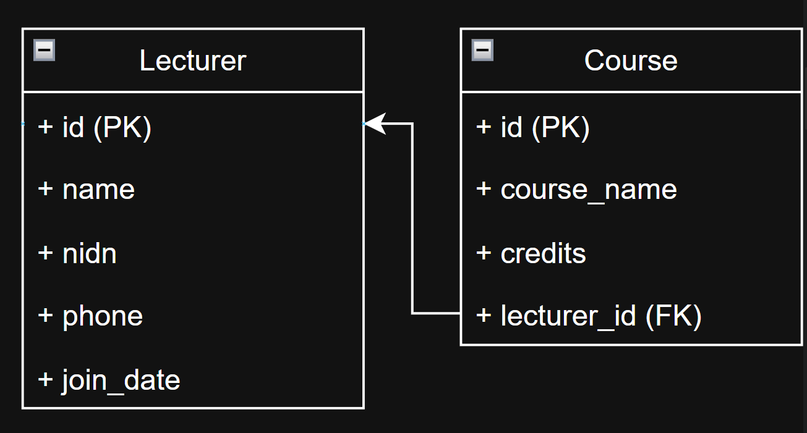

#### Class Lecturer (Dosen)
<pre>
  ● id (PK)        <strong>berupa int sebagai Primary Key dari tabel lecturers</strong>
  ● name           <strong>berupa varchar sebagai nama lengkap dosen</strong>
  ● nidn           <strong>berupa varchar sebagai Nomor Induk Dosen Nasional</strong>
  ● phone          <strong>berupa varchar sebagai nomor telepon dosen</strong>
  ● join_date      <strong>berupa date sebagai tanggal bergabung dosen</strong>
</pre>

#### Class Course (Mata Kuliah)
<pre>
  ● id (PK)           berupa int sebagai Primary Key dari tabel courses
  ● course_name       berupa varchar sebagai nama mata kuliah
  ● credits           berupa int sebagai jumlah SKS mata kuliah
  ● lecturer_id (FK)  berupa int sebagai Foreign Key yang berelasi dengan
                      tabel lecturers (Mata Kuliah ini diajar oleh Dosen siapa)
</pre>
● Relasi utamanya adalah Lecturer (One) -> Course (Many). Satu dosen bisa mengajar banyak mata kuliah.

#### Penjelasan File Utama (Struktur MVC)
models/ (Logika Data):
<pre>
● DB.php:       Bertanggung jawab untuk koneksi ke database MySQL (tp_mvc25).
● Lecturer.php: Menangani query SQL (CRUD) untuk tabel dosen.
● Course.php:   Menangani query SQL (CRUD) untuk tabel mata kuliah,
                termasuk query JOIN untuk mengambil nama dosen.
</pre>

#### controllers/ (Logika Alur):
<pre>
● LecturerController.php: Mengatur permintaan user terkait dosen, memanggil Model Lecturer,
                          dan mengirim data ke View.
● CourseController.php:   Mengatur permintaan user terkait mata kuliah. Controller ini memanggil Model Course 
                          (untuk data matkul) dan Model Lecturer (untuk dropdown list dosen).
</pre>

#### views/ (Tampilan UI):
<pre>
● Berisi file antarmuka pengguna (User Interface) dengan tema Dark Mode Professional.
● lecturer_index.php, course_index.php:    Menampilkan tabel data.
● <strong>create.php, edit.php</strong>:   Menampilkan form input/edit data.
● navbar.php:                              Komponen navigasi yang dipisah agar modular (reusable).
</pre>

#### index.php (Routing):
<pre>
● Bertindak sebagai Router / Pintu Masuk Utama.
● Menerima parameter URL (mod & act) untuk menentukan Controller mana yang dipanggil
  dan Aksi apa yang harus dilakukan (Create/Read/Update/Delete).
</pre>

### Flow Program

<pre>
● User membuka Web (index.php)
● Router mengecek URL, misal: index.php?mod=course
● Controller meminta data ke Model (Database)
● Model mengembalikan data (Array)
● Controller mengirim data ke View
● View menampilkan tabel data dengan desain Dark Mode   READ
● User menekan tombol Tambah/Edit/Hapus                CREATE/UPDATE/DELETE
</pre>

### Connect Database
<pre>
● Aplikasi terhubung ke database MySQL bernama tp_mvc25.
● Konfigurasi koneksi terdapat di file models/DB.php menggunakan mysqli.
● Terdapat relasi Foreign Key pada tabel courses yang terhubung ke tabel lecturers
  dengan fitur ON DELETE CASCADE (jika dosen dihapus, matkul ikut terhapus).
</pre>

## 📋 Requirements

<pre>
● Arsitektur MVC: Memisahkan Model, View, dan Controller secara tegas. ✅
● 2 Entitas Utama: Lecturers (Dosen) dan Courses (Mata Kuliah). ✅
● Relasi Database: Relasi 1-to-Many antara Dosen dan Mata Kuliah. ✅
● CRUD Lengkap: Fitur Create, Read, Update, Delete untuk kedua entitas. ✅
</pre>

## 📸 Dokumentasi

Berikut adalah Dokumentasi berupa Screenshot saat program dijalankan di Browser.

### Tampilan Data Dosen Awal (READ)
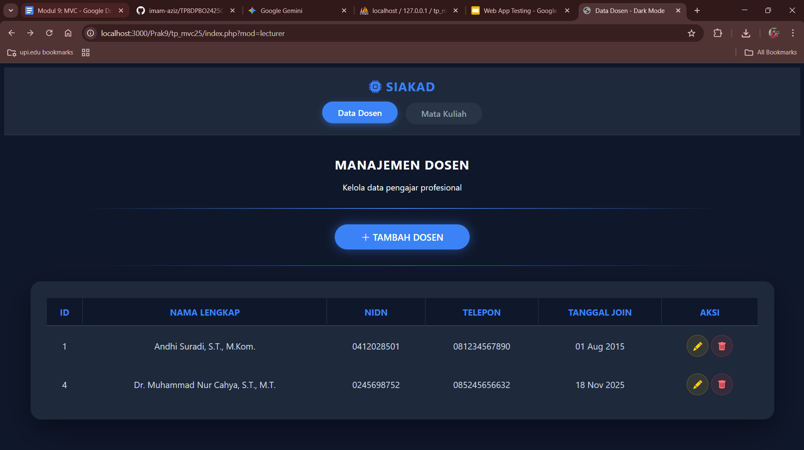

### Tambah Data Dosen (CREATE)
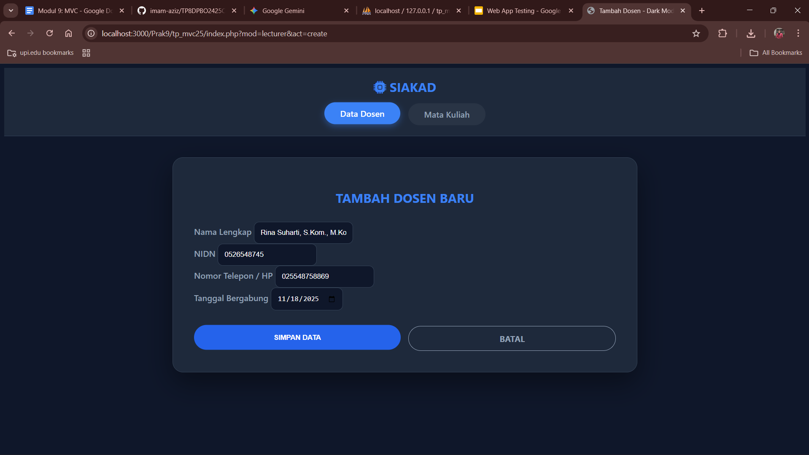
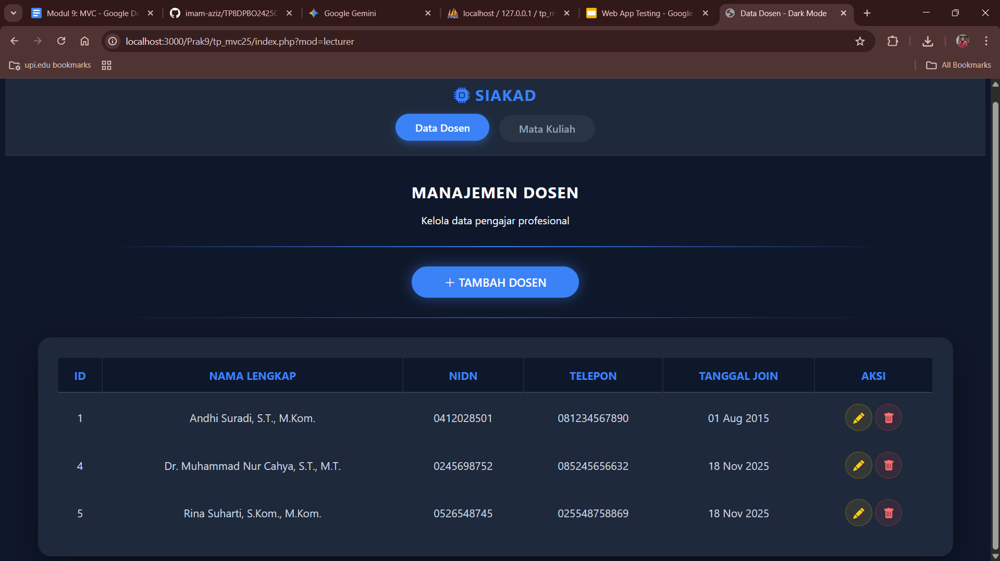

### Edit Data Dosen (Update)
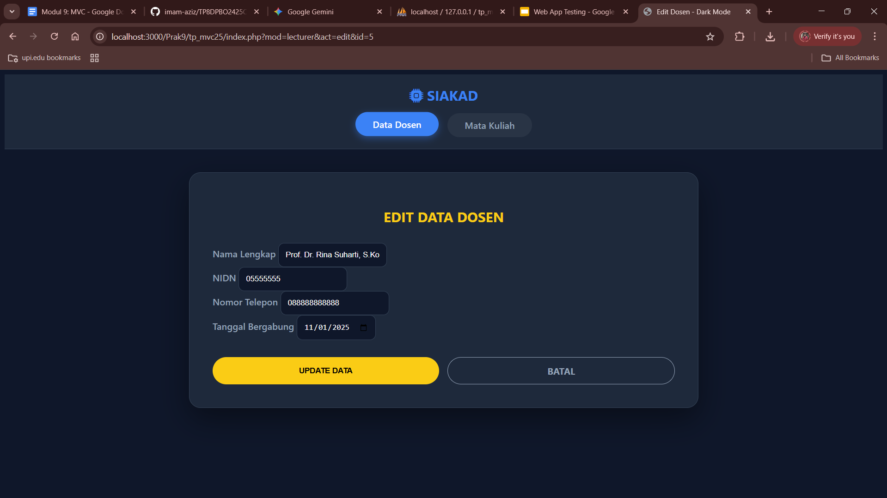
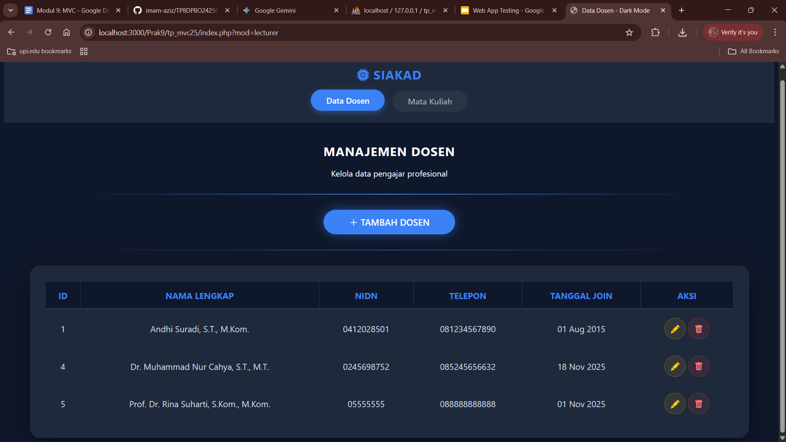

### Hapus Data Dosen (Delete)
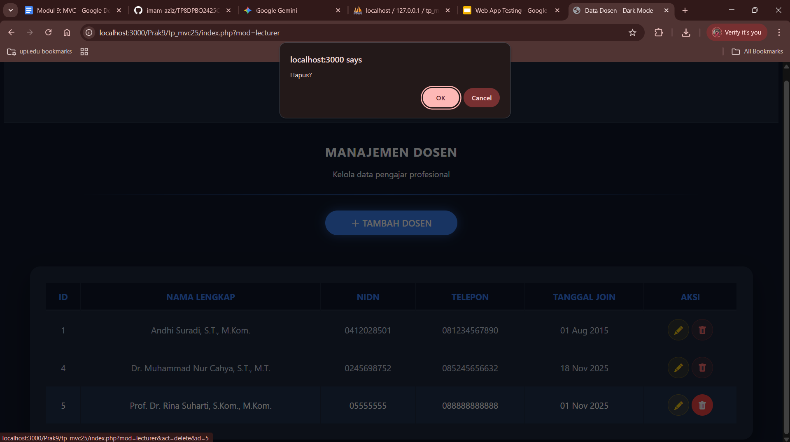
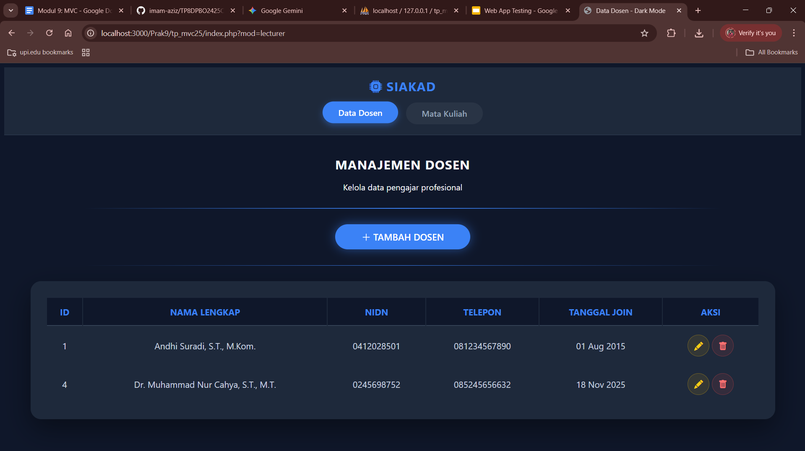

### Tampilan Data Mata Kuliah Awal (READ + JOIN)
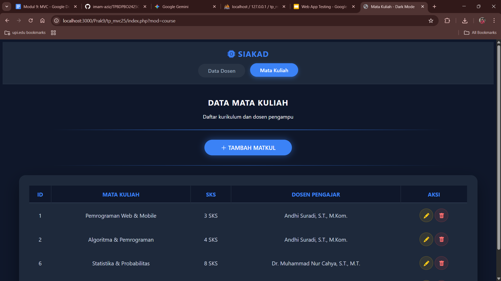

### Tambah Data Mata Kuliah (Create)
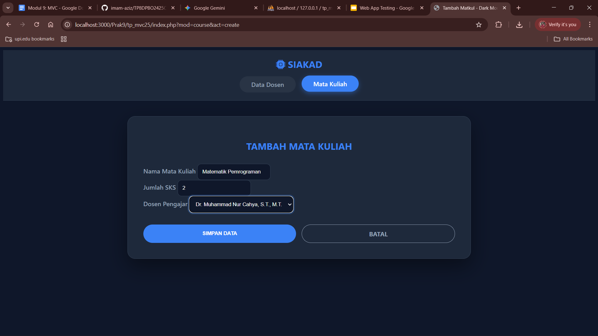
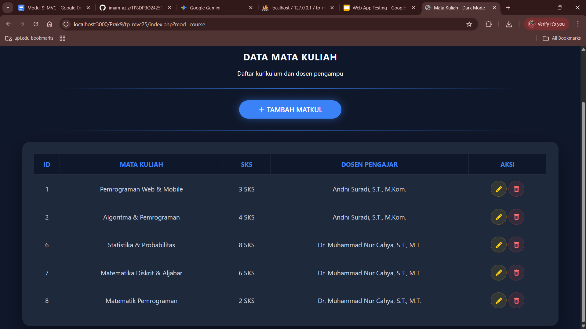

### Edit Data Mata Kuliah (Update)
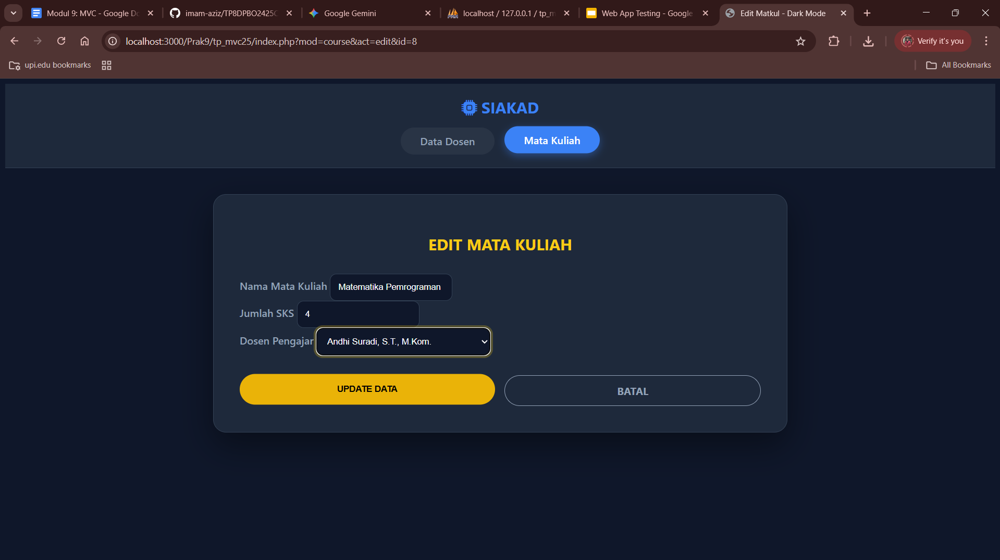
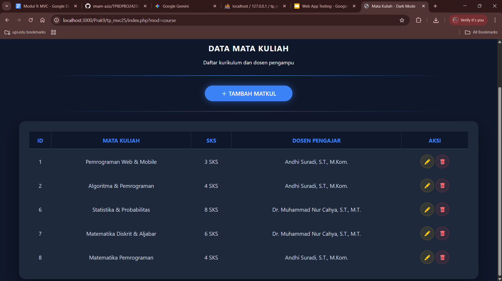

### Hapus Data Mata Kuliah (Delete)
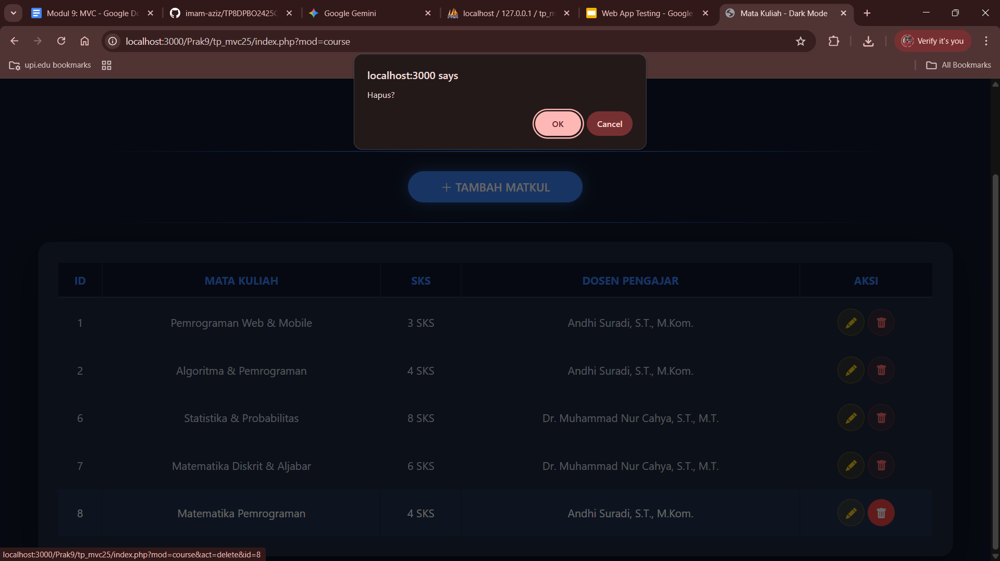
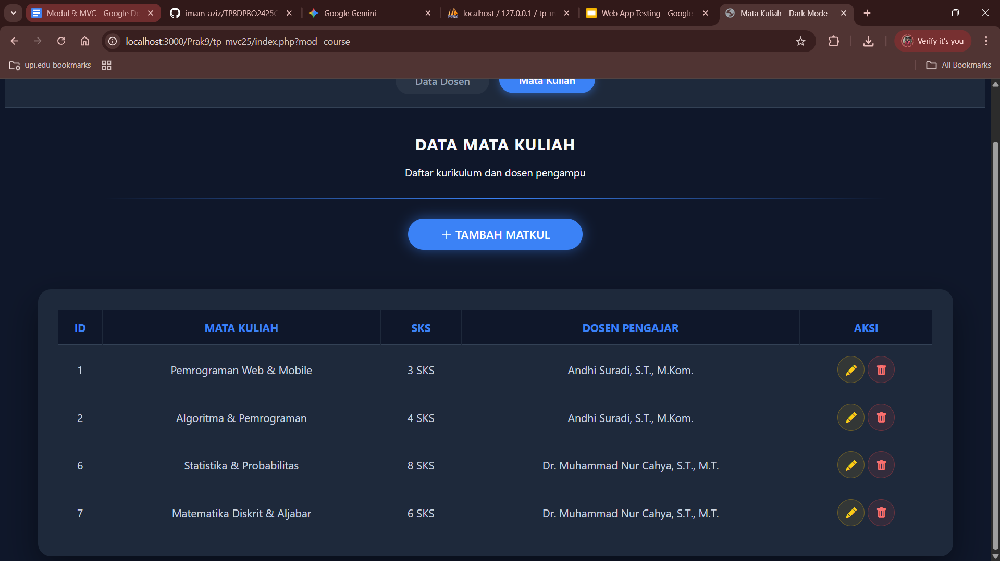
